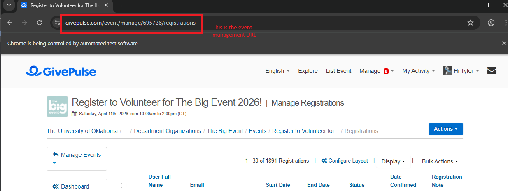

# GivePulse Export Tool

GivePulse Export Tool is an automated script to help University of Oklahoma (OU) users quickly export event registration data from GivePulse. It completely automates the login process (including SSO navigation and clicking through cookie popups) and automatically navigates to your specific event to export "All Data".

There are two ways to use this tool:
1. **GUI Application:** A user-friendly desktop interface (recommended).
2. **Terminal Script:** A command-line version.

## Prerequisites

Before running the tool, ensure you have the following installed on your computer:
1. [Python 3](https://www.python.org/downloads/)
2. **Google Chrome** browser

## Setup

1. Open your terminal or command prompt.
2. Navigate to the folder containing these files.
3. Install the required Python packages by running:
   ```bash
   pip install -r requirements.txt
   ```

## How to Run

### Option 1: Using the GUI (Recommended)
The GUI provides a sleek interface where you can easily enter your credentials and watch the automation progress.

Simply **double-click** the `Run GivePulse.bat` file in this folder to launch the application.

**Steps in the GUI:**
1. Enter your **OU Email or OUNetID**.
2. Enter your **Password**.
3. Paste the **Event Management URL** for the specific GivePulse event you want to export. (e.g., `https://www.givepulse.com/event/manage/695728/registrations`)

   *(Example of the Event Management URL:)*
   

4. *(Optional)* Check the **"Save inputs for next time"** box so you don't have to type them again later.
5. Click **"Run Export"**.
6. A Google Chrome window will open. **Do not close it!**
7. If you have Two-Factor Authentication (2FA) enabled for OU SSO, complete the 2FA prompt in the browser when it appears.
8. The script will automatically finish the export!

### Option 2: Using the Terminal
If you prefer the command-line, you can run the original script:

```bash
python givePulse.py
```

The script will ask you for your Event Management URL. If you want to avoid typing your credentials every time, you can manually create a `.env` file in the same folder with the following contents:
```env
OU_EMAIL=your_email@ou.edu
OU_PASSWORD=your_password
EVENT_URL=https://www.givepulse.com/event/manage/12345/registrations
```

## Troubleshooting

- **"Chrome failed to start" / WebDriver errors:** Make sure your Google Chrome browser is up to date.
- **SSO Login Fails:** Ensure your OU email and password are correct.
- **Automation stops unexpectedly:** If GivePulse updates their website design, the automation selectors may need to be updated.
